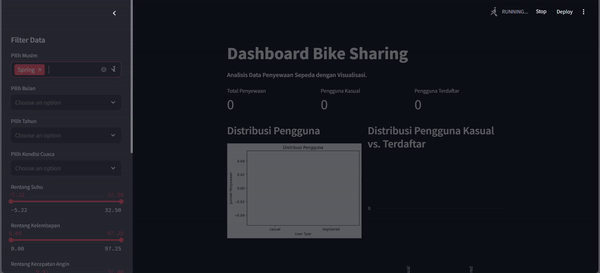

# Dashboard Bike Sharing
## Preview
```

```

## WorkFlow Analisis Data Bike Sharing
**1.Data Wrangling**
  Proses pertama dalam proyek adalah data wrangling, di mana data mentah dibersihkan, diproses, dan disiapkan untuk analisis lebih lanjut. Langkah-langkahnya meliputi:
  - **Menghapus missing values**: Memastikan tidak ada data yang hilang atau mengisi data yang hilang dengan nilai default atau rata-rata.
  - **Mengubah format data**: Menyesuaikan format kolom, misalnya mengonversi tanggal menjadi tipe data datetime.
  - **Menghapus duplikasi**: Memastikan tidak ada baris data yang duplikat.
  - **Menyaring data**: Memilih subset data yang relevan dan menghapus data yang tidak diperlukan.
    
**2.Exploratory Data Analysis (EDA)**
  Setelah data siap, langkah berikutnya adalah melakukan Exploratory Data Analysis (EDA), di mana kita mengeksplorasi pola, tren, dan hubungan dalam data. Tujuannya adalah untuk memahami    distribusi dan hubungan antar variabel.
  - **Statistik deskriptif**: Menggunakan statistik dasar seperti rata-rata, median, standar deviasi untuk memahami data lebih lanjut.
  - **Distribusi variabel**: Melihat distribusi data dengan histogram atau box plot.
  - **Korelasi antar variabel**: Menggunakan matriks korelasi atau scatter plot untuk melihat hubungan antar fitur.

**3.Data Visualization**
  Setelah menganalisis data, langkah selanjutnya adalah visualisasi data untuk menyampaikan temuan secara lebih jelas. Visualisasi membantu untuk menonjolkan pola atau hubungan yang         sebelumnya tidak terlihat.
  - **Grafik distribusi**: Seperti histogram, box plot, atau violin plot.
  - **Grafik korelasi**: Scatter plot atau heatmap untuk memahami hubungan antar variabel.
  - **Grafik kategori**: Bar plot atau pie chart untuk melihat distribusi kategori.

**4.Dashboard Streamlit**
  Setelah melakukan analisis dan visualisasi data, Anda bisa mempresentasikan hasilnya dalam bentuk dashboard Streamlit yang interaktif. Streamlit memungkinkan pembuatan antarmuka           pengguna dengan visualisasi data, filter interaktif, dan banyak fitur lainnya.
  - **Menampilkan grafik dan tabel**: Menampilkan grafik dan tabel interaktif untuk analisis lebih lanjut.
  - **Interaktivitas**: Menambahkan elemen filter seperti slider, dropdown, atau input text untuk berinteraksi dengan data.
  - **Penggunaan layout**: Mengatur layout dashboard untuk tampilan yang bersih dan mudah dipahami.


## Cara Menjalankan Project Dashboard di Streamlit:
**1.Unduh Proyek**
Pertama, unduh proyek Dashboard ke komputer Anda untuk memulai.

**2.Instalasi Streamlit dan Library yang Dibutuhkan**
  - Buka terminal atau command prompt Anda.
  - Instal Streamlit dengan perintah berikut:
    *pip install streamlit*
  - Selain Streamlit, Anda juga perlu menginstal beberapa library lain yang diperlukan, seperti Pandas, Matplotlib, Seaborn, dan Plotly. Anda bisa menginstalnya satu per satu:
    *pip install pandas matplotlib seaborn plotly*
  - Atau, jika Anda memiliki file requirements.txt di dalam folder proyek, cukup jalankan perintah berikut untuk menginstal semua library sekaligus:
    *pip install -r requirements.txt*

**3.Pastikan Lokasi File CSV**
  - Perhatikan bahwa file CSV yang berfungsi sebagai sumber data harus tetap berada di dalam folder yang sama dengan file dashboard.py. Jangan memindahkan file CSV ini, karena itu sangat      penting untuk menjalankan proyek dengan benar.
**4.Menjalankan File Dashboard**
  - Gunakan editor teks pilihan Anda, seperti VSCode atau PyCharm, untuk membuka proyek.
  - Setelah membuka folder proyek, jalankan file dashboard.py dengan perintah berikut di terminal:
  *streamlit run dashboard/dashboard.py*
Dengan mengikuti langkah-langkah di atas, Anda dapat dengan mudah menjalankan Dashboard Streamlit dan mulai menikmati visualisasi data yang telah dibuat. Selamat mencoba!

## Link Hasil Deploy
https://dashboard-bikes.streamlit.app/
